<div align="center">


<h1>Backup Cost Analyzer (BCA)</h1>

<p><strong>The Institutional-Grade Platform for Standardized Resilience Foundations, FinOps Governance, and Multi-Cloud BCA Ecosystems.</strong></p>

[]()
[]()
[]()

<br/>

> **"Industrializing institutional cost intelligence to automate resilience foundations."** 
> **Backup Cost Analyzer (BCA)** is an enterprise-grade platform designed to provide a secure, measurable, and highly automated foundation for global resilience operations. It orchestrates the complex lifecycle of backup economy—from automated billing reconciliation and multi-cloud waste detection to high-throughput financial intelligence and unified resilience auditing.

</div>

---

## 🏛️ Executive Summary

Unmanaged backup spend and lack of FinOps visibility are strategic operational liabilities; lack of a standardized BCA framework is a primary barrier to organizational engineering maturity. Organizations fail to optimize their backup budgets not because of a lack of tools, but because of fragmented evaluation standards, lack of automated waste detection, and an inability to orchestrate resilience planes with operational precision.

This platform provides the **Resilience Intelligence Plane**. It implements a complete **Backup-Cost-Analyzer-as-Code Framework**, enabling CTOs and FinOps Architects to manage global resilience foundations as first-class citizens. By automating the identification of financial regressions through real-time telemetry analysis and orchestrating the provisioning of secure performance-driven resilience policies, we ensure that every organizational backup—from core database snapshots to edge cloud archives—is analyzed by default, audited for history, and strictly aligned with institutional resilience frameworks.

---

## 📐 Architecture Storytelling: Principal Reference Models

### 1. Principal Architecture: Global Backup Cost Analyzer & Resilience Intelligence Plane
This diagram illustrates the end-to-end flow from resilience telemetry ingestion and multi-cloud orchestration to cost enforcement, performance validation, and institutional resilience auditing.

```mermaid
graph LR
    %% Subgraph Definitions
    subgraph ResilienceIngress["Billing & Usage Ingress"]
        direction TB
        Billing_Signals["Cloud Billing Files / API Usage Logs / Cost Exports"]
        Resource_Metadata["Storage Tiers / Snapshot Counts / Retention Rules"]
        Financial_Baselines["Budget Targets / Forecast History / ROI Stats"]
    end

    subgraph IntelligenceEngine["Resilience Intelligence Hub"]
        direction TB
        API["FastAPI Resilience Gateway"]
        CostOrchestrator["Global Cost & FinOps Hub"]
        Governance_Hub["Compliance & Guardrail Hub"]
        AIOps_Validator["Drift & Waste Analysis Hub"]
    end

    subgraph OperationsPlane["Distributed Resilience Ecosystem"]
        direction TB
        ManagedCostNodes["Managed Standardized Analytics Hubs"]
        ActiveRunbooks["Managed Automated Optimization Runbooks"]
        CloudSinks["Managed Infrastructure Delivery Hubs"]
    end

    subgraph OperationsHub["Institutional Data Hub"]
        direction TB
        Scorecard["Resilience Maturity Scorecard"]
        Analytics["Cost Flow & ROI Velocity Stats"]
        Audit["Forensic Resilience Metadata Lake"]
    end

    subgraph DevOps["Backup-Cost-Analyzer-as-Code Framework"]
        direction TB
        TF["Terraform Resilience Modules"]
        DriftBot["Productivity & Config Drift Validator"]
        ChatOps["Measurement Operations Hub"]
    end

    %% Flow Arrows
    ResilienceIngress -->|1. Submit Telemetry| API
    API -->|2. Orchestrate Resilience| CostOrchestrator
    CostOrchestrator -->|3. Apply Privacy Guard| Governance_Hub
    Governance_Hub -->|4. Assess Drift| AIOps_Validator
    
    AIOps_Validator -->|5. Execute Optimization| OperationsPlane
    OperationsPlane -->|6. Notify Status| ChatOps
    API -->|7. Visualize Health| Scorecard
    
    Scorecard -->|8. Track Maturity| Analytics
    Scorecard -->|9. Record Performance| Audit
    
    TF -->|10. Provision Backbone| IntelligenceEngine
    DriftBot -->|11. Inject Friction Risk| CostOrchestrator
    Audit -->|12. Improve Operations| ManagedCostNodes

    %% Styling
    classDef ingress fill:#f5f5f5,stroke:#616161,stroke-width:2px;
    classDef intel fill:#e8eaf6,stroke:#1a237e,stroke-width:2px;
    classDef operations fill:#e1f5fe,stroke:#01579b,stroke-width:2px;
    classDef ops fill:#ede7f6,stroke:#311b92,stroke-width:2px;
    classDef devops fill:#e8f5e9,stroke:#1b5e20,stroke-width:2px;

    class ResilienceIngress ingress;
    class IntelligenceEngine intel;
    class OperationsPlane operations;
    class OperationsHub ops;
    class DevOps devops;
```

### 2. The Cost Lifecycle Flow
The continuous path of a BCA platform from initial integration (collect) and aggregation (detect) to active analysis (tier), optimization (forecast), and institutional forensic auditing (scorecard).

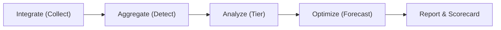

### 3. Distributed Resilience Topology
Strategically orchestrating standardized resilience across global regions, diverse cloud architectures, and multi-cloud targets, providing a unified institutional view of global resilience health and operational readiness.

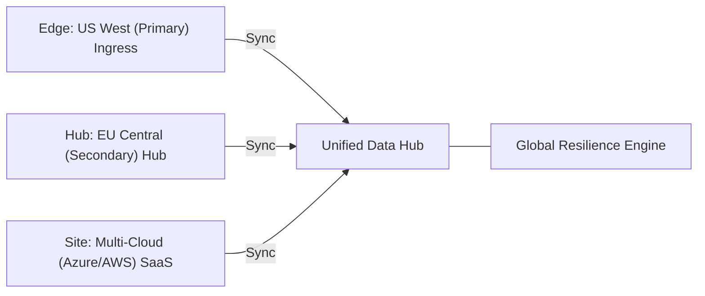

### 4. Cost Hub & High-Trust Data Plane Protection Flow
Executing complex logic for securing the bridge between cost owners and technical teams, ensuring every organizational identity is verified, performance-level privacy is maintained, and every resilience access is according to institutional standards.

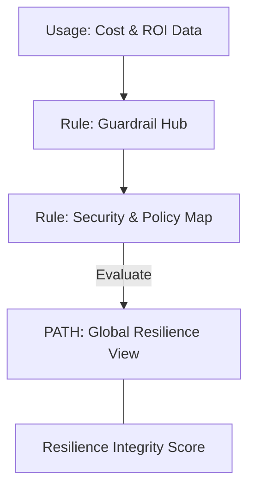

### 5. Multi-Cloud Cost Federation & Governance Flow
Automatically managing unified resilience standards across global regions and diverse cloud tenants, ensuring institutional data residency and privacy boundaries by default.

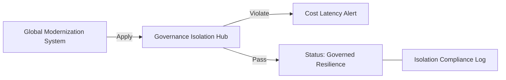

### 6. Encryption & Perimeter Protection Flow (Cost Standard)
Managing the lifecycle of a resilience request, automatically enforcing institutional TLS 1.3 and resource encryption standards as required by security policy, ensuring zero-latency security confidence.

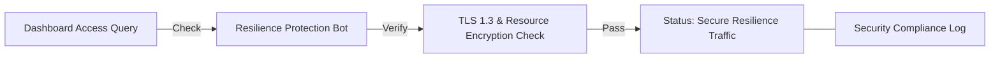

### 7. Institutional Resilience Maturity Scorecard
Grading organizational performance based on key indicators: Cost Reduction Index, Waste Elimination Index, and Resilience Adoption Scores.

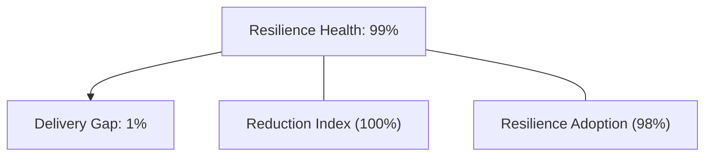

### 8. Identity & RBAC for Cost Governance
Managing fine-grained access to resilience hubs, provisioning workers, and audit logs between CTOs, FinOps Architects, and Finance Managers.

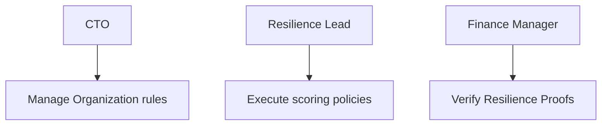

### 9. IaC Deployment: Backup-Cost-Analyzer-as-Code Framework
Using modular Terraform to deploy and manage the versioned distribution of the resilience tracking hubs, sync protection workers, and forensic metadata lakes.

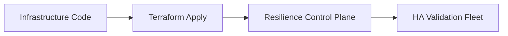

### 10. AIOps Cost Drift & Risk Validation Flow
Using advanced analytics to identify sudden surges in backup costs, unauthorized rule changes, suspicious configuration drifts, or unusual delivery pattern changes that could result in institutional risk or budget failure.

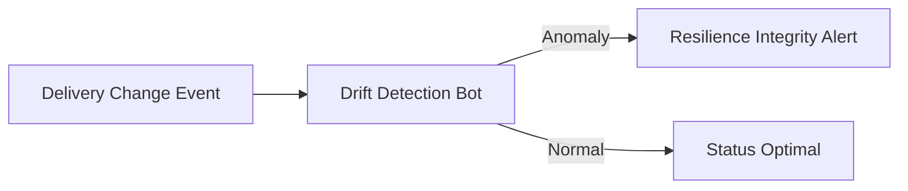

### 11. Metadata Lake for Forensic Cost Audit
Storing long-term records of every resilience integration event (metadata), every cost optimized, and every version history for institutional record-keeping, compliance auditing, and post-provisioning forensics.

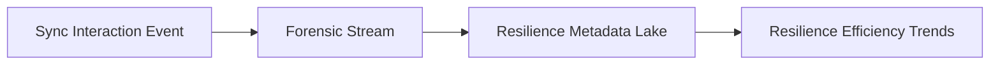

---

## 🏛️ Core Governance Pillars

1.  **Unified Foundation Coordination**: Maximizing resilience by centralizing all resilience measurement through a single institutional plane.
2.  **Automated Waste Provisioning**: Eliminating "manual tracking" scenarios through proactive orchestration and pattern verification.
3.  **Sequential Resilience Intelligence**: Ensuring zero-interruption operations through dependency-aware cost-driven data engineering.
4.  **Zero-Trust Identity Protection**: Automatically enforcing identity-based access, data-at-rest encryption, and policy evaluation across all assurance tiers.
5.  **Autonomous Operations Logic**: Guaranteeing reliability through automated industry-specific effectiveness monitoring runbooks.
6.  **Full Resilience Auditability**: Immutable recording of every cost change and resilience provision for institutional forensics.

---

## 🛠️ Technical Stack & Implementation

### Resilience Engine & APIs
*   **Framework**: Python 3.11+ / FastAPI.
*   **Performance Engine**: Custom Python-based logic for multi-cloud billing reconciliation and DORA-style resilience metrics.
*   **Integrations**: Native connectors for Azure Cost Management, AWS Cost Explorer, and Google Cloud Billing.
*   **Persistence**: PostgreSQL (Resilience Ledger) and Redis (Live Cost State).
*   **Auth Orchestrator**: Federated OIDC/SAML for least-privilege resilience management access.

### Governance Dashboard (UI)
*   **Framework**: React 18 / Vite.
*   **Theme**: Dark, Slate, Indigo (Modern high-fidelity productivity aesthetic).
*   **Visualization**: D3.js for delivery topologies and Recharts for ROI velocity analytics.

### Infrastructure & DevOps
*   **Runtime**: AWS EKS or Azure Kubernetes Service (AKS) for management plane.
*   **Measurement Hub**: Managed event sourcing for immutable productivity timeline reconstruction.
*   **IaC**: Modular Terraform for deploying the resilience landing zone and validation fleet.

---

## 🏗️ IaC Mapping (Module Structure)

| Module | Purpose | Real Services |
| :--- | :--- | :--- |
| **`infrastructure/resilience_hub`** | Central management plane | EKS, PostgreSQL, Redis |
| **`infrastructure/enforcers`** | Distributed cost provisioners | Azure, AWS, GCP APIs |
| **`infrastructure/cost_pipes`** | Data Ingestion Hubs | Webhooks, Lambda |
| **`infrastructure/auditing`** | Forensic modernization sinks | S3, Athena, Quicksight |

---

## 🚀 Deployment Guide

### Local Principal Environment
```bash
# Clone the Backup Cost Analyzer repository
git clone https://github.com/devopstrio/backup-cost-analyzer.git
cd backup-cost-analyzer

# Configure environment
cp .env.example .env

# Launch the Resilience stack
make init

# Trigger a mock resilience update and automated guardrail validation simulation
make simulate-cost
```

Access the Management Portal at `http://localhost:3000`.

---

## 📜 License
Distributed under the MIT License. See `LICENSE` for more information.

---
<div align="center">
  <p>© 2026 Devopstrio. All rights reserved.</p>
</div>
