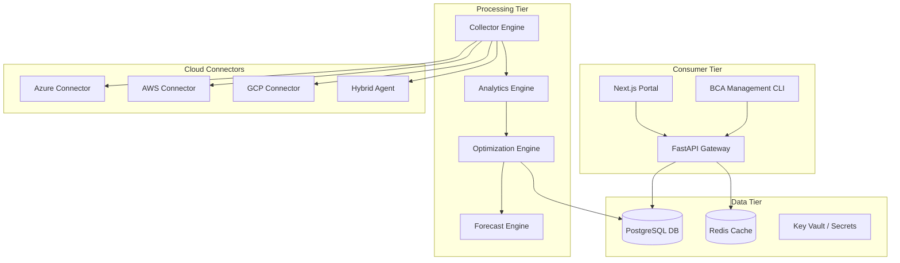
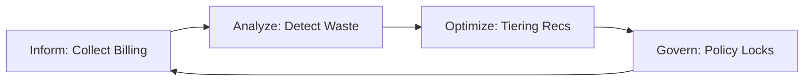
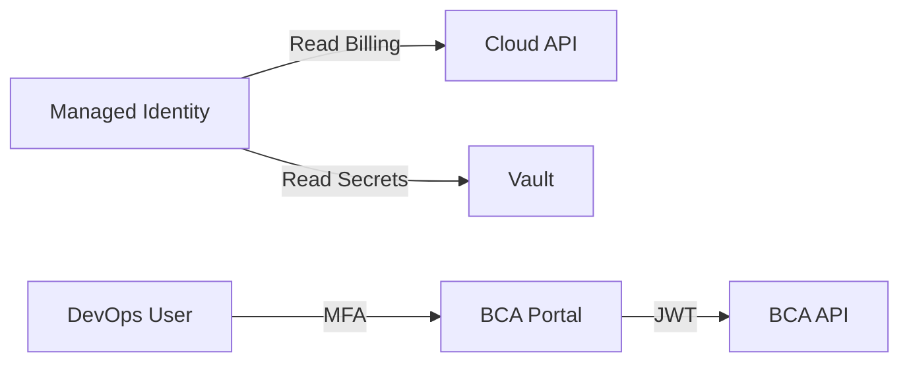

<div align="center">


<h1>Backup Cost Analyzer (BCA)</h1>

<p><strong>The Enterprise Flagship Platform for Multi-Cloud Backup Observability, FinOps Governance, and Waste Elimination</strong></p>

[]()
[]()
[]()
[]()

<br/>

> **"Unmanaged backup data is the silent killer of cloud budgets."** 
> Backup Cost Analyzer (BCA) is an institutional-grade FinOps engine that provides deep visibility into global backup spend, identifies orphaned snapshots, and automates cost optimization across Azure, AWS, and Hybrid environments.

</div>

---

## 📋 Executive Summary

The **Backup Cost Analyzer (BCA)** is a centralized command center for enterprise backup economy. By aggregating fragmented billing data and technical metadata across multiple cloud providers and on-premise vaults, BCA identifies systemic waste, over-retention, and tiering opportunities that traditional cloud native tools miss.

### 🚀 Strategic Business Outcomes
- **Reduce Backup Spend**: Instantly identify and eliminate orphaned snapshots and redundant protection sets, typically saving enterprises 15-30% in first-pass optimization.
- **Improved ROI**: Move cold data from Hot to Archive tiers automatically based on verified workload-specific recovery requirements.
- **Accurate Chargeback**: Enable granular showback/chargeback by mapping backup costs to Business Units via advanced tag correlation.
- **Future-Proof Forecasting**: Use AI-driven growth modeling to predict storage spend 12-24 months into the future.

---

## 🏛️ High-Level Architecture

BCA follows a distributed, event-driven pattern designed for high-availability and zero-trust security.



### 💉 FinOps Operating Model



---

## ⚙️ Key Capabilities

- **Orphaned Snapshot Detection**: Cross-references snapshots with active disks to find resources "left behind" by decommissioned VMs.
- **Multi-Cloud Ingestion**: Native support for Azure Recovery Services, AWS Backup, and GCP Backup & DR.
- **Tiering Heatmaps**: Visualizes storage distribution (Hot vs Cold vs Archive) across global regions.
- **Automated Chargeback**: Generates boardroom-ready Excel/PDF reports mapping spend to internal Cost Centers.
- **SaaS Protection Analysis**: Specific modules for M365 and Salesforce backup spend audit.

---

## 📂 Repository Structure

```text
backup-cost-analyzer/
├── apps/
│   ├── portal/             # Next.js 14 Dashboard UI
│   ├── api/                # FastAPI Global Gateway
│   ├── collector-engine/   # Multi-cloud ingestion workers
│   ├── analytics-engine/   # Waste detection logic
│   └── forecast-engine/    # ML-based spend prediction
├── backend/                # Shared core services & models
├── database/               # SQL schemas & migrations
├── terraform/              # Enterprise Infrastructure as Code
│   ├── modules/            # Hardened AKS, Postgres, Redis modules
│   └── main.tf             # Global blueprint
├── k8s/                    # Production Kubernetes manifests
├── helm/                   # Service orchestration charts
├── security/               # Zero-Trust & RBAC documentation
├── .github/workflows/      # Enterprise CI/CD pipelines
└── README.md               # Flagship Product Documentation
```

---

## 🚀 Deployment Guide

### 1. Provision Infrastructure (Terraform)
BCA requires a managed Kubernetes cluster (AKS) and the supporting data plane.

```bash
cd terraform
terraform init
terraform apply -var-file="prod.tfvars"
```

### 2. Orchestration (Helm)
Deploy the platform services to the production namespace.

```bash
helm install bca ./helm/backup-cost-analyzer \
  --namespace bca-prod \
  --create-namespace
```

---

## 🛡️ Security Trust Boundary



- **Encryption**: AES-256 for all stored metrics; TLS 1.3 for all traffic.
- **Identity**: System-assigned managed identities for secret-less cloud access.
- **Network**: Private Endpoints (PE) for all DB and Redis connections.

---

## 🤝 Support & Roadmap
- **Strategy Consulting**: strategy@devopstrio.com
- **Enterprise Status**: [Status Page](https://status.devopstrio.com)

<div align="center">


**Building the future of enterprise infrastructure — one blueprint at a time.**

</div>
