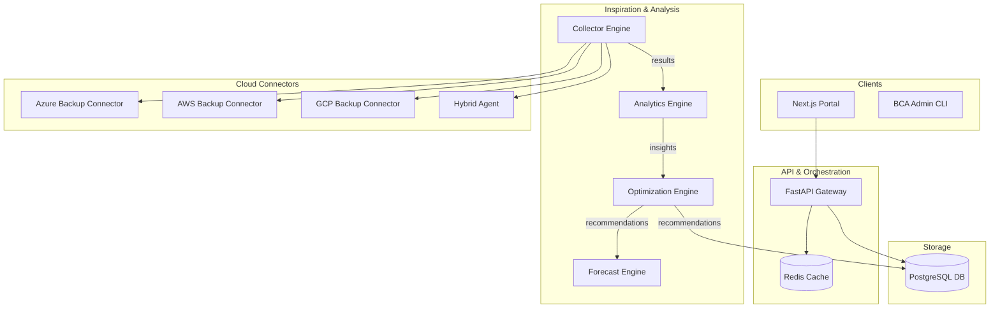

# 📊 Backup Cost Analyzer (BCA): Enterprise Deployment Blueprint

[]()
[]()

---

## 🏛️ Architecture Overview

The BCA platform follows a distributed, event-driven architecture designed to handle massive multi-cloud data estates.



## 🚀 Deployment Guide

### 1. Terraform Infrastructure
BCA requires a managed Kubernetes cluster (AKS/EKS), a PostgreSQL instance, and Key Vault for secret management.

```bash
cd terraform
terraform init
terraform plan -out=bca.tfplan
terraform apply bca.tfplan
```

### 2. Kubernetes Orchestration
Once the infrastructure is ready, deploy the workload using Helm.

```bash
helm install bca ./helm/backup-cost-analyzer \
  --namespace bca-system \
  --create-namespace \
  --values ./helm/values-prod.yaml
```

## 📊 FinOps Lifecycle

BCA operates on a continuous 4-phase loop:

1.  **Inform**: Collectors ingest real-time billing and metadata across clouds.
2.  **Analyze**: Engines detect waste (orphaned disks) and retention inefficiencies.
3.  **Optimize**: Platform suggests tiering (Cool/Archive) and retention right-sizing.
4.  **Govern**: CI/CD pipelines prevent non-compliant (over-expensive) policy creation.

---

## 🔐 Security Model
Everything is **Zero-Trust**.
- mTLS for all inter-service communication.
- OAuth2/OIDC (Entra ID) for Portal Authentication.
- Secrets stored in Azure Key Vault / AWS Secrets Manager.
- RBAC enforces separation between Cloud Ops and FinOps roles.

## 🤝 Support
- Enterprise: support@devopstrio.com
- Internal Slack: #platform-bca
